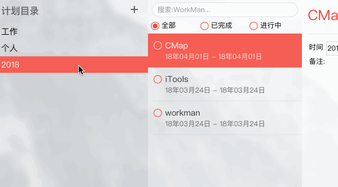

# VContextmenu

右键菜单功能



> don't see img? [click here](https://github.com/ektx/v-contextmenu)

## 使用方式

1. 安装

```shell
yarn add @ektx/v-contextmenu
```

2. 在 vues 的 state 中添加共享状态与方法

> 请先确保你有使用 vuex

```javascript
import setContextmenu from '@ektx/v-contextmenus/store'

const store = new Vuex.Store({
	state: {},
	// add this mutations
	mutations: {
		setContextmenu
	}
})
```

3. 在页面中调用组件

```html
<template>
	<main>
		<!-- 绑定事件 -->
		<div @contextmenu.prevent="rightClick"></div>

		<!-- 引用 HTML 结构 -->
		<VContextmenus></VContextmenus>
	</main>
</template>

<script>
	// 引入
	import VContextmenus from '@ektx/v-contextmenus'

	export default {
		components: {
			VContextmenus
		},
		data () {
			return {
				// 菜单内容
				menu: {
					data: [
						{
							title: 'v-contenxtmenus',
							evt: function(data) {

								alert('Welcome Use v-contenxtmenus!')
								
							}
						},
						{
							title: '联系方式',
							children: [
								{
									title: 'ektx1989@gmail.com'
								},
								{
									title: '@宅龙猫'
								}
							]
						},
						{
							type: 'separator'
						},
						{
							title: 'Github.com',
							evt: function() {

							}
						},
						{
							type: 'separator'
						},
						{
							disabled: true,
							title: 'v 0.1.0'
						}
					]
				}
			}
		},
		methods: {
			// 自定义事件
			rightClick (evt) {
				store.commit('setContextmenu', {
					data: this.menu, evt
				})
			}
		}
	}
</script>
```

## 事件方法

* 展示菜单功能

> store.commit('setContextmenu', {data, evt})

@data 菜单内容
@evt 鼠标事件


* 关闭菜单

> store.commit('setContextmenu', { show: false })

